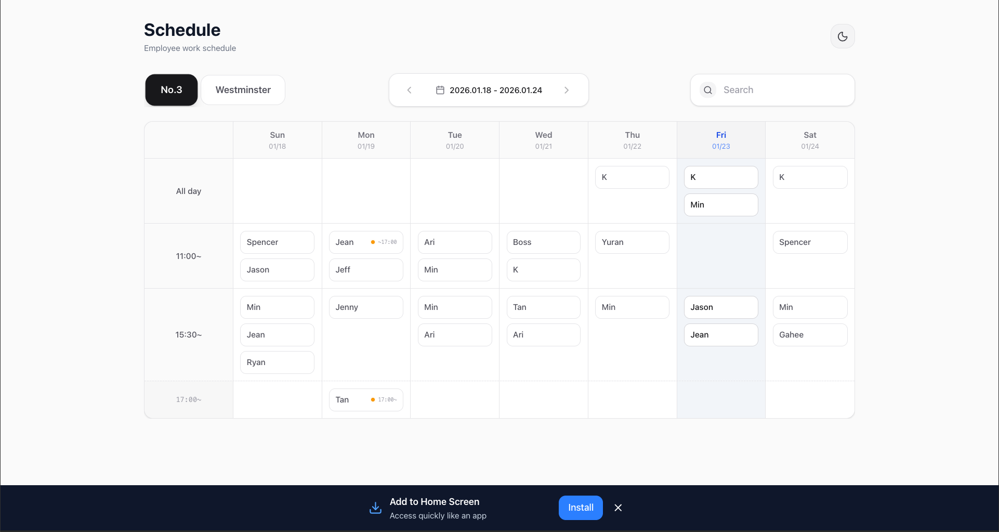
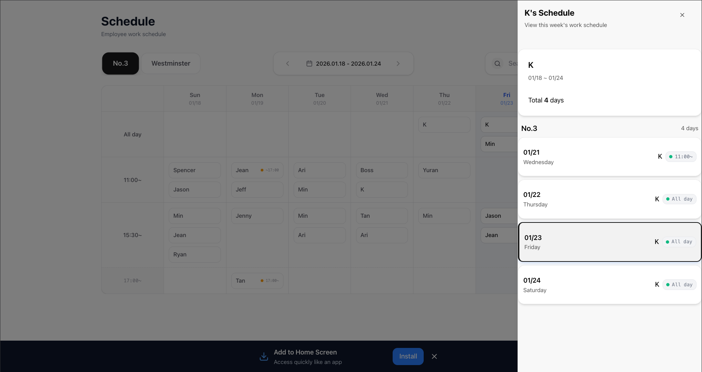
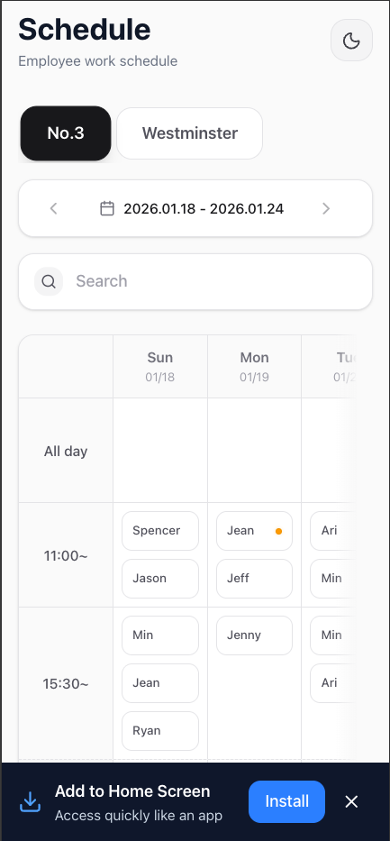
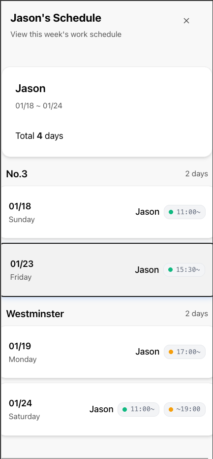

# Smart Schedule Viewer

> Turning a restaurant whiteboard into a mobile-first web app—built with accessibility and simplicity at its core.

A read-only schedule viewer that uses Google Sheets as a CMS, enabling small business managers to update schedules without learning new software while employees access their shifts from anywhere.

**[Live](https://emplanner.vercel.app/)** | [GitHub](https://github.com/jeffseongjunkim/chicko-schedule)

---

## 🎯 The Problem

My parents run a family restaurant with two locations (~5km apart), managing 15-20 employees across both sites. Their scheduling system? **Physical whiteboards at each location.**

### Pain Points:

- **Physical limitation**: Employees had to visit the restaurant or request a photo to check their shifts
- **Dual-location complexity**: Staff working at both locations needed to check two separate whiteboards
- **Manual updates**: Every schedule change meant the manager individually messaging affected employees
- **Poor visibility**: Finding your name on a crowded whiteboard took time

### Why Not Use Existing Solutions?

Commercial scheduling apps (When I Work, 7shifts, Deputy) were rejected because:

- **Cost**: Per-employee monthly fees add up for small businesses
- **Complexity**: My parents wanted something familiar, not a new system to learn
- **Overkill**: Features like time tracking and payroll integration were unnecessary

---

## 💡 The Solution

**What if Google Sheets became the admin interface, and a simple website became the employee view?**

```
Google Sheets (Manager edits) → Next.js ISR (Processing) → Static Site (Employee view)
```

- **For managers**: Continue using a spreadsheet format with zero learning curve
- **For employees**: Access schedules 24/7 from any device—no app installation required
- **For the business**: $0/month operating cost using Vercel's free tier

---

## 🎨 Key Design Decisions

### 1. Simplicity Over Features

| Decision                | Rationale                                                                              |
| ----------------------- | -------------------------------------------------------------------------------------- |
| Google Sheets as CMS    | Parents already familiar with spreadsheet thinking (rows = time slots, columns = days) |
| Read-only architecture  | No database, no auth, no CRUD complexity—just fast static pages                        |
| ISR with 60s revalidate | Real-time updates without manual deployment                                            |

### 2. Accessibility First

Built for users aged 10s-60s with varying tech comfort levels:

| Feature         | Implementation            | Why                                      |
| --------------- | ------------------------- | ---------------------------------------- |
| Large fonts     | 18px+ base size           | Readability for older employees          |
| Touch-friendly  | 44px+ touch targets       | Follows Apple HIG guidelines             |
| High contrast   | WCAG AA compliant colors  | Visibility in bright restaurant lighting |
| PWA support     | Add to Home Screen prompt | No app store friction                    |
| Personal filter | Name dropdown             | Quick "when do I work?" checks           |

### 3. Test-Driven Development

Started with TDD to ensure reliability:

- **148 tests** covering components, utilities, and API routes
- Jest + React Testing Library for component behavior validation
- Integration tests for Google Sheets parsing logic

---

## 🛠 Tech Stack

| Category    | Technology                               |
| ----------- | ---------------------------------------- |
| Framework   | Next.js 16 (App Router, ISR)             |
| Language    | TypeScript                               |
| Styling     | Tailwind CSS v4 + shadcn/ui              |
| Data Source | Google Sheets API                        |
| Cache       | Vercel Postgres (via Prisma)             |
| Testing     | Jest + React Testing Library (148 tests) |
| Deployment  | Vercel (free tier)                       |

**Architecture Pattern**: JAMstack with ISR for near-real-time updates

---

## 📊 Outcomes

| Before                                     | After                                        |
| ------------------------------------------ | -------------------------------------------- |
| Visit restaurant to check schedule         | Check website from anywhere, anytime         |
| Search crowded whiteboard for your name    | Filter by name with dropdown (instant)       |
| Check two locations separately             | See both locations in one view               |
| Manager messages each employee on changes  | Employees self-serve updates within 1 minute |
| **Manager**: Learn new scheduling software | **Manager**: Just edit Google Sheets         |

### Technical Achievements:

- **$0/month** operating cost (Vercel free tier + Google Sheets)
- **145 passing tests** ensuring code reliability
- **<1s page load** via static generation
- **60s update latency** from Sheets to web
- **PWA installable** as home screen app

---

## 📸 Screenshots

| Weekly Grid View                                       | Personal Schedule                                         |
| ------------------------------------------------------ | --------------------------------------------------------- |
|                  |                  |
|  |  |

---

## 🚀 Quick Start

## 🚀 Quick Start

```bash
# Clone and install
git clone https://github.com/jeffseongjunkim/chicko-schedule.git
cd chicko-schedule
npm install

# Set up environment variables
cp .env.example .env.local
# Edit .env.local with your Google Sheets API credentials

# Run development server
npm run dev
```

Open [http://localhost:3000](http://localhost:3000)

### Environment Variables Required

| Variable                       | Description                 |
| ------------------------------ | --------------------------- |
| `GOOGLE_SERVICE_ACCOUNT_EMAIL` | GCP Service Account email   |
| `GOOGLE_PRIVATE_KEY`           | Service Account JSON key    |
| `GOOGLE_SHEET_ID`              | Document ID from Sheets URL |

See [full setup guide](docs/SETUP.md) for detailed Google Sheets API configuration.

---

## 📋 Google Sheets Structure

The app expects a specific Google Sheets format:

### Sheet 1: `Employees`

| A (Name) |
| -------- |
| John     |
| Jane     |
| Alice    |

### Sheet 2-3: `No3_Schedule`, `Westminster_Schedule`

```
     A          B          C          D
1  [Location] Sunday     Monday     Tuesday
2             2025-01-04 2025-01-05 2025-01-06
3    *        Bob        Charlie    Alice
4
5   11:00     John       Jane(until 17:00)
6   15:30     Bob        Alice      John(from 17:30)
```

**Notation:**

- `*` (Row 3) = All day shift
- `11:00` = 11:00 AM start shift
- `15:30` = 3:30 PM start shift
- `Name(until HH:MM)` = work until specified time
- `Name(from HH:MM)` = work from specified time

---

## 🧪 Testing

```bash
npm test                  # Run all tests
npm run test:watch        # Watch mode
npm run test:coverage     # Coverage report
```

**131 tests** covering:

- Component rendering and interactions
- Schedule parsing logic
- Google Sheets API integration
- Edge cases (empty schedules, invalid data)

---

## 📂 Project Structure

```
chicko-schedule/
├── app/                      # Next.js App Router
│   ├── page.tsx             # Main page (Server Component)
│   ├── api/schedule/        # ISR API routes
│   └── api/cron/            # Weekly sync endpoint
├── components/              # React components
│   ├── ScheduleViewer.tsx   # Main client component
│   ├── WeeklyGrid.tsx       # Grid view
│   └── PersonalSchedule.tsx # Personal view
├── lib/
│   ├── google-sheets.ts     # Google Sheets API client
│   ├── schedule-parser.ts   # Parse sheet data
│   └── db/                  # Prisma client + queries
├── __tests__/               # Jest tests (131 tests)
└── prisma/schema.prisma     # Database schema
```

---

## 🚢 Deployment

Deploy to Vercel with one click:

[](https://vercel.com/new/clone?repository-url=https://github.com/jeffseongjunkim/chicko-schedule)

Set the required environment variables in Vercel dashboard, then deploy.

---

## 📝 License

MIT License

---

## 👤 Author

**Jeff Kim** ([@jeffseongjunkim](https://github.com/jeffseongjunkim))

Built with ❤️ for small family businesses.
