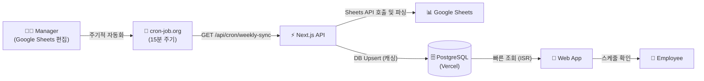

# Chicko Schedule (스마트 스케줄 뷰어) 프로젝트 상세 명세서

이 문서는 `chicko-schedule` 프로젝트의 전체적인 아키텍처, 구성 요소, 워크플로우 및 다른 프로젝트(예: `chicko-payroll`, 신규 `chicko-portal`)와의 통합을 위해 작성된 종합 가이드입니다. 이 문서만으로도 본 프로젝트의 동작 원리를 파악하고 통합/확장 작업을 수행할 수 있도록 상세히 기술되었습니다.

---

## 1. 프로젝트 개요 및 핵심 설계 철학

`chicko-schedule`은 가족 운영 레스토랑의 직원들이 자신의 스케줄을 쉽게 확인할 수 있도록 만들어진 **모바일 최적화 읽기 전용 스케줄 뷰어**입니다.

- **핵심 설계 철학:** 
  - **Google Sheets as CMS:** 매니저는 새로운 소프트웨어를 배울 필요 없이 기존 방식(스프레드시트)으로 스케줄을 작성합니다.
  - **Read-Only (읽기 전용):** 본 웹앱에서는 스케줄을 조회만 하며, 어떠한 쓰기 작업(수정/삭제)도 발생하지 않습니다.
  - **No Auth (인증 없음):** 직원들은 로그인 없이 드롭다운에서 자신의 이름을 선택해 스케줄을 확인합니다.
- **기술 스택:** Next.js 16 (App Router), TypeScript, Tailwind CSS v4, Prisma (PostgreSQL), Vercel

---

## 2. 시스템 아키텍처 및 워크플로우

본 프로젝트의 데이터 흐름은 단방향(One-way)으로 이루어집니다.



### 2.1 동기화(Sync) 워크플로우
1. **트리거:** 외부 서비스(`cron-job.org`)가 15분마다 `/api/cron/weekly-sync` 엔드포인트를 호출합니다.
2. **데이터 수집:** `lib/google-sheets.ts` 로직이 Google Sheets API를 통해 데이터를 가져옵니다.
3. **데이터 파싱:** `lib/schedule-parser.ts`를 통해 시트의 원시 데이터를 구조화된 JSON 배열로 변환합니다.
4. **DB 업데이트 (캐싱):** `lib/db/sync.ts` 로직이 Prisma를 사용해 DB에 데이터를 Upsert 합니다. 이때 이전 주차의 불필요한 데이터(3주 경과)는 삭제(`cleanupOldWeeks(3)`)됩니다.

---

## 3. 타 프로젝트와의 통합 전략 (Integration Guide)

현재 생태계에는 이 프로젝트(`chicko-schedule`) 외에도 급여 처리 봇(`chicko-payroll`), 그리고 새롭게 구축될 출퇴근 포탈(`chicko-portal`)이 존재합니다. 

**대원칙: `chicko-schedule`은 수정하지 않는다.**
본 프로젝트는 매우 안정적으로 동작하는 독립된 시스템이므로, 타 시스템과 통합할 때 본 프로젝트 내부 로직을 수정하는 것은 피해야 합니다.

### 3.1 신규 출퇴근 포탈 (`chicko-portal`)과의 통합
직원의 출퇴근(Clock-in/out)을 기록하는 포탈이 신규 개발될 예정입니다.
- **통합 방식 (결정사항 S1):** 완전히 별도의 새로운 레포지토리 및 DB(Supabase)로 구축.
- **연결점:** `chicko-schedule`의 UI에는 단순히 **"출퇴근(Clock-in/out)" CTA 버튼(링크)** 만을 추가하여 직원이 포탈로 이동할 수 있게끔만 라우팅합니다.
- **데이터 공유:** 포탈은 `chicko-schedule`의 DB나 API에 의존하지 않고, 자체적으로 15분 단위 Cron을 돌려 Google Sheets에서 스케줄을 읽어가서 자체 DB에 1년간 보관합니다.

### 3.2 신원 매핑 (Identity Mapping) 주의사항
각 시스템마다 직원을 식별하는 방식이 다릅니다. 통합 프로젝트 구축 시 반드시 아래 매핑 테이블(Bridge)을 신규 포탈 측에 구현해야 합니다.
- **스케줄 시트 (본 프로젝트):** 단일 이름 (`Ryan`, `Jason` 등)
- **Payroll 시트 (`chicko-payroll`):** Last Name / First Name 조합 (예: `Liang` / `Kengjie(Jason)`)
- **출퇴근 포탈 (`chicko-portal`):** 이메일 기반 Auth UID

---

## 4. 데이터베이스 스키마 (`prisma/schema.prisma`)

본 프로젝트의 DB는 성능 최적화 및 외부 API 의존도를 낮추기 위한 **캐시(Cache)** 용도로 사용됩니다.

- **`Week` 모델:**
  - 주차 정보를 관리합니다. `weekStart` (월요일 기준 등)를 기준으로 고유(UK) 식별합니다.
  - 최신 동기화 시간(`syncedAt`)을 기록합니다.
- **`ScheduleEntry` 모델:**
  - `Week`에 종속(Foreign Key, `onDelete: Cascade`)됩니다.
  - 직원 이름(`employeeName`), 날짜(`date`), 요일(`dayOfWeek`), 시프트(`shift` - 예: `11:00`, `*`), 지점(`location`), 근무 노트(`noteType`, `noteTime` - 예: until 17:00)를 저장합니다.
- **⚠️ 중요 주의사항:** 
  `Week` 데이터는 `cleanupOldWeeks(3)`에 의해 3주가 지나면 삭제되며, Cascade 설정으로 인해 관련 `ScheduleEntry` 데이터도 모두 날아갑니다. 따라서 타 프로젝트에서 이 테이블에 Foreign Key를 연결해서는 **절대** 안 됩니다. 영구 기록이 필요하다면 다른 저장소에 복제/스냅샷을 떠야 합니다.

---

## 5. 구글 시트 데이터 컨벤션

`lib/schedule-parser.ts`가 시트를 해석하는 규칙입니다. 통합 프로젝트에서 동일한 데이터를 읽어갈 때 반드시 참고해야 합니다.

- **Sheet 1 (`Employees`):** A열에 직원 이름 목록이 존재.
- **Sheet 2~ (`No3_Schedule`, `Westminster_Schedule`):** 
  - 각 시트의 이름이나 내부 데이터로 **지점(Location)**을 구분.
  - `Row 3`: `*` 표시는 All day (8시간 풀타임) 근무를 의미.
  - 숫자로 표기된 시간 (예: `11:00`, `15:30`): 해당 시간부터 시작되는 시프트.
  - **특이사항 메모:** `이름(until 17:00)` 또는 `이름(from 17:30)` 형태로 파트타임 스케줄을 메모함.
  - **종료 시간:** 시트에는 명시적인 '종료 시간' 규칙이 없음에 유의해야 합니다.

---

## 6. 디렉토리 및 코드 구조

```text
chicko-schedule/
├── app/                      
│   ├── page.tsx             # 메인 클라이언트 페이지 (서버 컴포넌트)
│   ├── api/schedule/        # 스케줄 조회 API (직원별, 주차별)
│   └── api/cron/            # [핵심] 외부 Cron이 호출하는 동기화 엔드포인트
├── components/              
│   ├── ScheduleViewer.tsx   # 메인 뷰어 컴포넌트 (UI 진입점)
│   ├── WeeklyGrid.tsx       # 전체 그리드 뷰 컴포넌트
│   └── PersonalSchedule.tsx # 직원 개인별 필터링 뷰 컴포넌트
├── lib/
│   ├── google-sheets.ts     # Google Sheets API 클라이언트 로직
│   ├── schedule-parser.ts   # 시트 데이터를 DB 스키마에 맞게 파싱하는 핵심 로직
│   └── db/sync.ts           # 파싱된 데이터를 Prisma를 통해 DB에 Upsert 및 정리
├── prisma/
│   └── schema.prisma        # 데이터베이스 스키마 및 모델 정의
└── __tests__/               # 유닛/통합 테스트 코드 (jest)
```

---

## 7. 로컬 개발 및 디버깅 가이드

다른 프로젝트 작업을 하다가 본 프로젝트의 동작을 검증해야 할 경우의 설정 방법입니다.

1. **환경 변수 (`.env.local`):**
   - `GOOGLE_SERVICE_ACCOUNT_EMAIL`, `GOOGLE_PRIVATE_KEY`: Google Sheets API 접근용
   - `GOOGLE_SHEET_ID`: 타겟 스프레드시트 ID
   - `POSTGRES_URL`: Vercel Postgres 접속 URL
   - `CRON_SECRET`: API 무단 호출 방지용 시크릿 키
2. **동기화 강제 실행:**
   로컬 개발 환경에서 최신 데이터를 받아오려면, POST 요청으로 강제 동기화가 가능합니다.
   ```bash
   curl -X POST http://localhost:3000/api/cron/weekly-sync \
        -H "Authorization: Bearer <CRON_SECRET>"
   ```
3. **디버그 API:**
   - 파싱되기 전의 원시 시트 데이터를 보려면 `/api/debug` 엔드포인트를 활용하세요.

---

## 8. 맺음말 및 체크리스트

이 문서에 기술된 바와 같이, `chicko-schedule`은 매우 독립적이고 목적이 뚜렷한 "읽기 전용 캐싱 뷰어"입니다. 
다른 프로젝트(포탈 등)를 개발할 때 다음 사항만 유념하시면 됩니다:
- [ ] **본 프로젝트의 코드나 DB 스키마를 건드리지 말 것** (필요시 CTA UI만 추가).
- [ ] 타 프로젝트에서 스케줄 데이터가 필요하다면, **본 프로젝트의 `lib/google-sheets.ts` 및 `lib/schedule-parser.ts` 코드를 참고하여 타 프로젝트에 복사(Porting)** 후 독자적인 동기화 파이프라인을 구축할 것.
- [ ] 이름 매핑 이슈(단일 이름 vs Last/First Name vs Email)를 타 프로젝트의 DB 설계 단계에서 반드시 해결할 것.
